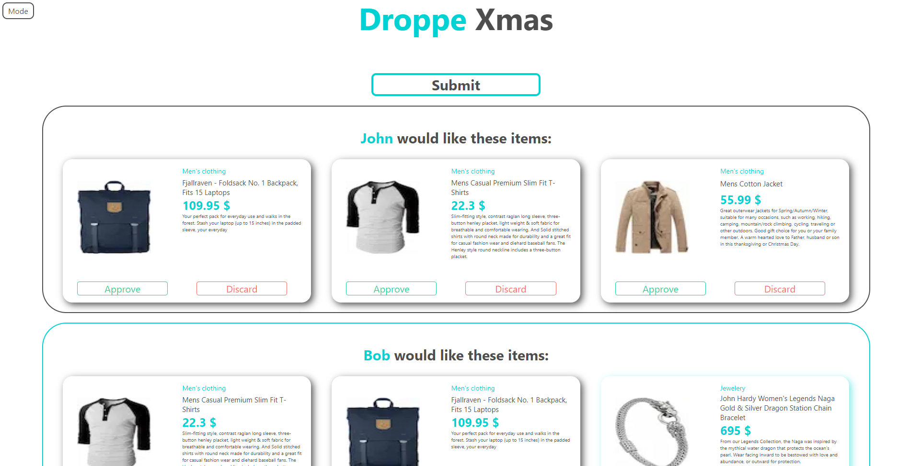
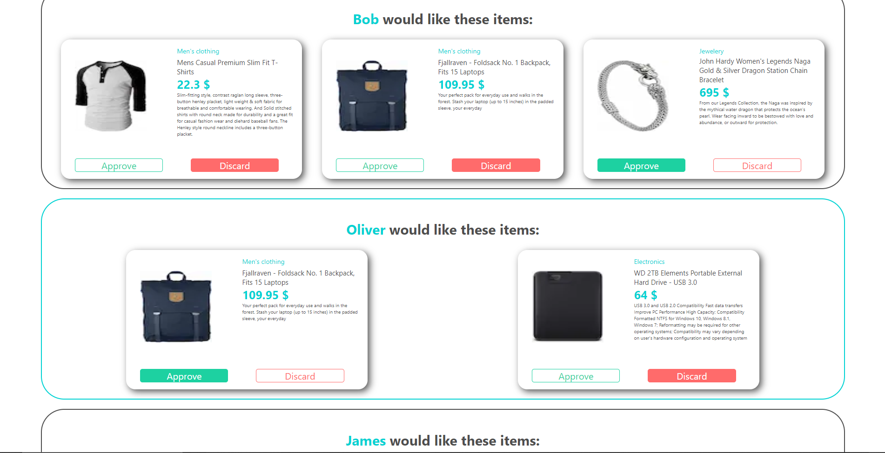
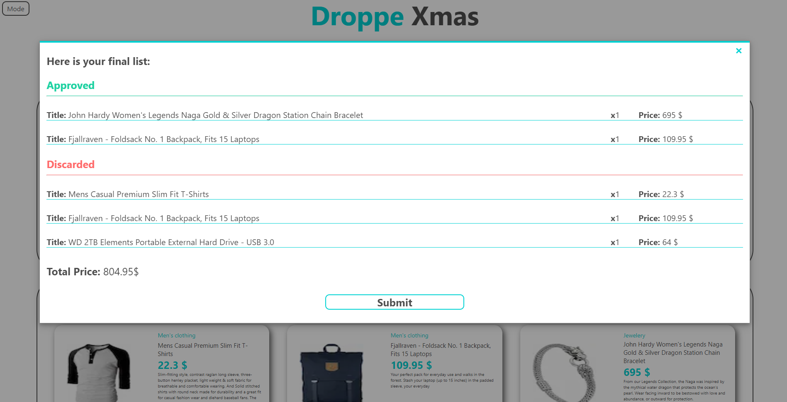
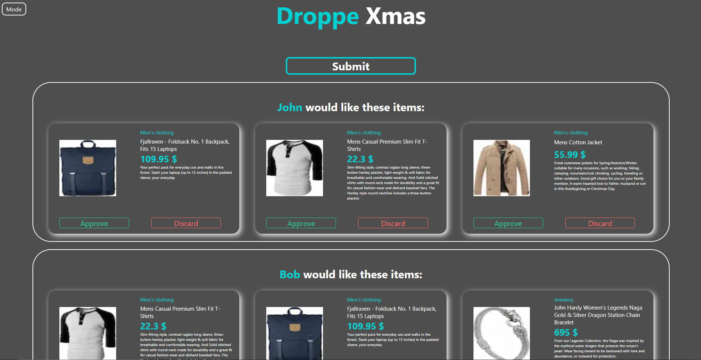

# Droppe Xmas

## Abstract

You’re building an intuitive cart approval process for parents. That is, a flow with high usability for an
imaginary christmas gift picking marketplace. The primary user persona of your interface will be a 50
year old parent with differing (usually low) levels of tech nativeness.

## Technologies and services
- Next.js
- SCSS
- Cypress
- Github Actions
- Heroku
- https://fakestoreapi.com/

## Main Commands

Run locally:
```
npm run dev
```
Run cypress:
```
npm run cypress
```

## Link
https://xmas-shop.herokuapp.com/

## Screenshots




